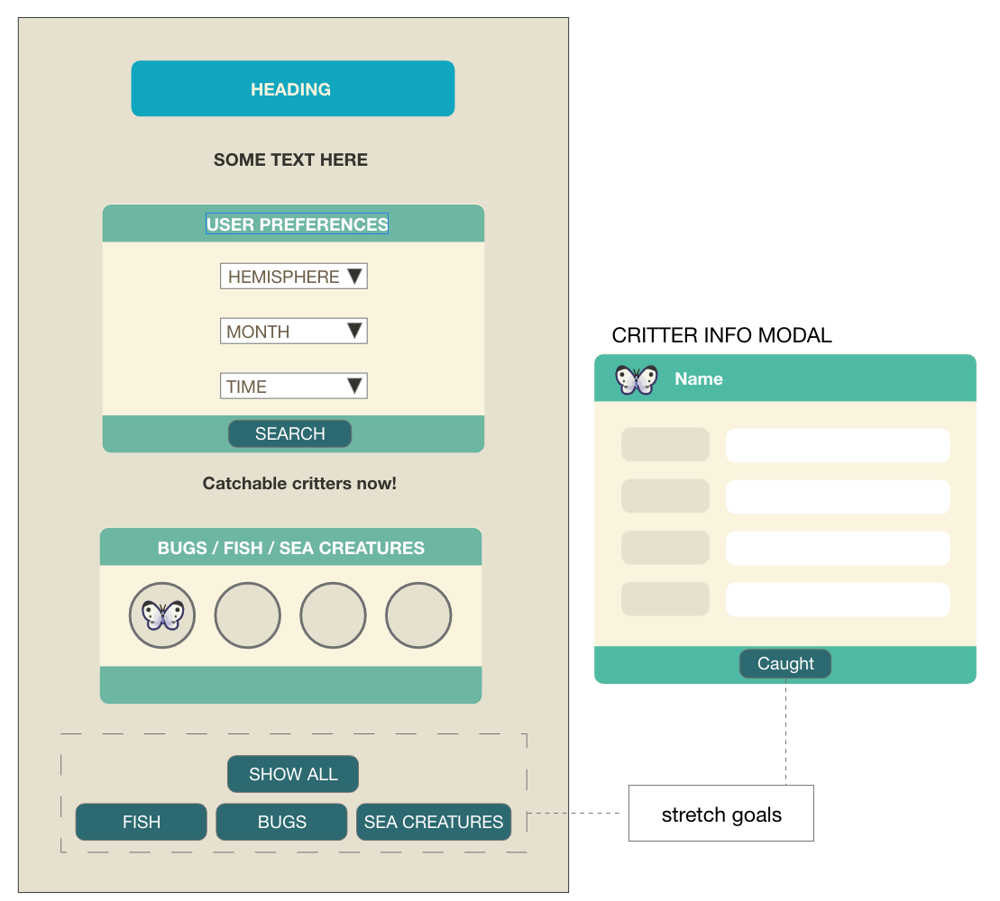

Juno College Web Development Bootcamp - Project 1

## Table of contents

- [Overview](#overview)
  - [Objective](#the-challenge)
  - [Screenshot](#screenshot)
- [My process](#my-process)
  - [Built with](#built-with)
  - [What I learned](#what-i-learned)
- [Authors](#authors)

## Overview

### Objective

- An app that helps an islander discover all the critters available in Animal Crossing: New Horizon

### Screenshot

### Links

- Solution URL: [Code]()
- Live Site URL: [Preview]()

## Our process
### Pseudo code
- Home page with title and animal crossing background
-Form to fill out users information (hemisphere, month, time of day)
- Listen for button click to store users inputted information
- Upon form submission
  - store user inputs into variables
  - Make an AJAX request to the API based on user inputs to search matching critters
- Return critters based on criteria 
  - Display images, type, stats, location etc
  - Display based on availability (ie gray out what is not available to be caught/discovered) 
- Option to clear form and search again

### MVP
1. Landing page to welcome the user to the site
2. Prompt user for information (ie time of year/day/where they live/etc)
3. Return information to user regarding critters available to find based on inputs

### Wireframe

### Built with

- Semantic HTML5 markup
- CSS custom properties
- SCSS
- JavaScript

### What I learned

- Working with RESTful APIs
- Using the API data to dynamically create elements on the page

## Authors

Kaarina Nieminen & Christopher Leung